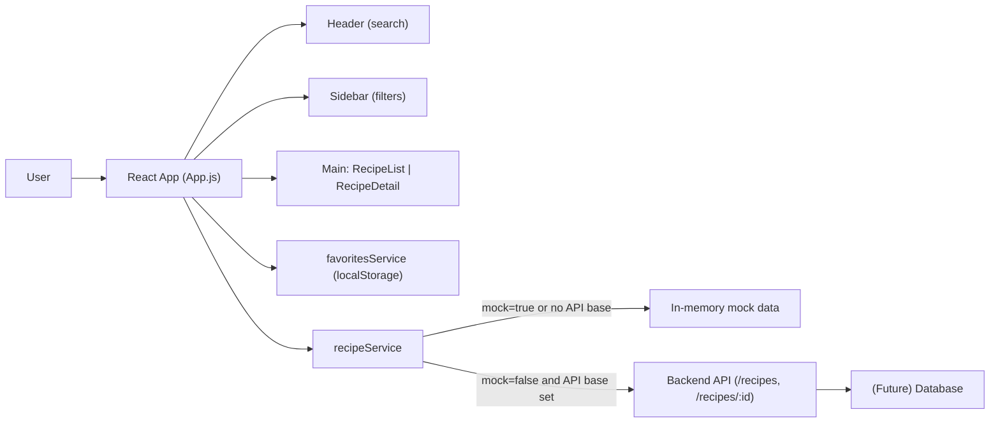

# Recipe Explorer Architecture

## Overview

Recipe Explorer is a lightweight React application that allows users to browse, search, and manage recipes through an intuitive and responsive UI. The current implementation is entirely frontend-based with a services layer that supports in-memory mock data to ensure a fully functional experience without a backend. The architecture is intentionally simple, enabling easy future integration of a real backend API and optional database.

The app follows a clean component structure, centralizes environment configuration and feature flags, and applies an “Ocean Professional” design theme using CSS variables and modern layout practices.

## Goals and Non-goals

### Goals
- Provide an intuitive browsing and search experience for recipes with a modern, responsive UI.
- Keep frontend lightweight with minimal dependencies, favoring vanilla CSS and React.
- Use a clear services layer that can switch between mock data and real API endpoints via environment configuration.
- Persist user favorites locally to enhance user experience without requiring authentication.
- Establish a maintainable structure with a clear separation of concerns across components, services, and styles.
- Support incremental evolution toward a backend API and database.

### Non-goals
- User authentication, authorization, and multi-user sync are not implemented in the current frontend.
- Server-side rendering or Next.js is not part of this setup.
- Real-time features (e.g., WebSockets) are not built into the current application.
- Backend logic, persistence beyond localStorage favorites, and database schemas are out of scope for the current codebase.

## High-Level Architecture

The current system consists of a single frontend container:

- recipe_app_frontend (React SPA)
  - Entry: src/index.js and src/App.js
  - UI Components: Header, Sidebar, RecipeList, RecipeDetail, Footer
  - Services: config (env/flags resolution), recipeService (data access), favoritesService (local persistence)
  - Styling: theme.css (Ocean Professional), layout.css, App.css
  - Mock data: In-memory recipes (used when feature flag mockData is enabled or when no API base URL is configured)

Future integration points:
- Backend REST API container (TBD) to provide recipe endpoints over HTTP(S)
- Database container (TBD) managed by the backend

### Architecture Diagram Description

- User’s Browser
  - React App (SPA)
    - Components: Header, Sidebar, RecipeList, RecipeDetail, Footer
    - State: recipes, filtered, categories, activeCategory, query, favorites, selectedId, loading, error
    - Services:
      - config: reads env vars and feature flags
      - recipeService: fetches recipes (mock or HTTP)
      - favoritesService: persists favorites to localStorage
- Future Backend (optional)
  - REST API: GET /recipes, GET /recipes/:id (and future endpoints)
  - Database: relational or document store containing recipe entities

Data flow: Components interact through props and local state in App. App orchestrates fetching via recipeService, applies filters and search, and persists favorites via favoritesService. When connected, recipeService would call the backend using base URLs from config.

## Containers and Responsibilities

### Frontend: recipe_app_frontend (current)
- Renders UI and handles user interactions (search, category selection, viewing details, favoriting).
- Fetches recipe data via recipeService, which can be configured to use mock data or real API calls based on environment configuration.
- Persists user favorites in localStorage via favoritesService.
- Applies Ocean Professional theme and responsive layout.

### Future Backend (planned)
- Provide REST endpoints for recipe listing and details:
  - GET /recipes
  - GET /recipes/:id
- Enforce validation, authentication (if introduced later), and rate limiting.
- Proxy data access to a database service, handling persistence, indexing, and caching.

### Future Database (planned)
- Store recipe entities with fields such as id, title, description, image, categories, ingredients, instructions, and metadata.
- Enable search and filtering (by category, keywords).
- Support indexing on common query fields.

## Component Architecture (React)

Components are located in src/components:

- Header (Header.js): Displays the app title, a search input, and a quick “All” navigation control. Emits query updates and “home” action to reset filters.
- Sidebar (Sidebar.js): Shows quick actions (All, Favorites) and a list of categories. Emits category filter selections and favorites filter activation. Displays favorites count badge.
- RecipeList (RecipeList.js): Renders a grid of recipe cards. Supports “View” to open details and “Favorite” toggle. Shows an empty state when no results.
- RecipeDetail (RecipeDetail.js): Displays detailed recipe information including image, time, categories, description, ingredients, and instructions. Provides back and favorite toggle actions.
- Footer (Footer.js): Static footer showing the current year and theme name.

App (src/App.js) orchestrates layout, state, and data fetching, rendering the above components within a responsive layout.

## State Management and Data Flow

State is managed locally in App.js using React hooks:
- recipes: all fetched recipes.
- filtered: recipes after applying category and search filters.
- categories: computed unique categories plus “All”.
- activeCategory: current category filter (“All”, a category name, or “Favorites”).
- query: search term for title and ingredients.
- selectedId: the ID of the currently selected recipe for detail view.
- favorites: a Set of recipe IDs persisted via favoritesService.
- loading: boolean to show loading states during fetch.
- error: error message shown when fetch fails.

Data Flow:
1. On mount, App initializes RecipeService using API base and mock flag from services/config.
2. App fetches recipes via recipeService.list(). While loading, a loading card is shown; on error, an error card is shown.
3. On success, App populates recipes and categories, and initializes filtered to recipes.
4. Filtering reacts to changes in query, activeCategory, or recipes to update filtered.
5. favorites updates are saved to localStorage through favoritesService.
6. Selecting a recipe sets selectedId, which switches the main area from list to detail view.
7. Back action clears selectedId, returning to the list.

## Routing and Navigation

The app currently uses a simple internal “routing-lite” pattern based on selectedId. There is no dependency on react-router. Navigation transitions:
- List view: when selectedId is null.
- Detail view: when selectedRecipe is derived from selectedId.
- “All” resets filters; “Favorites” sets activeCategory to “Favorites” and filters to favorited recipes.

This approach can be replaced later with react-router to enable deep links and browser navigation for individual recipes.

## Services Layer

Services are located in src/services.

### config.js
Purpose: Read and interpret environment configuration and feature flags.

- getApiBase(): Returns the API base URL from REACT_APP_API_BASE or REACT_APP_BACKEND_URL. If neither is set, returns an empty string.
- getFeatureFlags(): Parses REACT_APP_FEATURE_FLAGS as JSON and returns the flags object.
- isMockEnabled(): Returns true if featureFlags.mockData is true or if no API base URL is set.

Environment variables referenced:
- REACT_APP_API_BASE
- REACT_APP_BACKEND_URL
- REACT_APP_FEATURE_FLAGS

Note: While other variables may exist in deployment environments, the current codebase only uses the three above in the services/config logic.

### recipeService.js
Purpose: Fetch recipe data from either in-memory mock data or a real backend.

- Constructor(apiBase, { mock }): Chooses mock mode if mock is true or if apiBase is falsy.
- list(): Returns an array of recipes. In mock mode, returns in-memory MOCK_RECIPES after a short delay. Otherwise, fetches from `${apiBase}/recipes`.
- get(id): Returns a single recipe by id. In mock mode, finds the recipe locally after a short delay. Otherwise, fetches from `${apiBase}/recipes/${id}`.

Contract for backend integration:
- GET /recipes -> JSON array of recipe objects with fields used by the UI: id, title, time, image, categories, description, ingredients, instructions
- GET /recipes/:id -> JSON object for a single recipe

### favoritesService.js
Purpose: Persist favorites locally using localStorage.

- load(): Reads from localStorage key recipe_favorites_v1 and returns a Set of IDs.
- save(set): Writes the current Set of IDs to localStorage.

This service isolates persistence logic and allows easy replacement with backend persistence in the future.

## Environment Variables and Usage

Defined in ENVIRONMENT.md and leveraged by services/config.js:

- REACT_APP_API_BASE: Base URL for primary API, e.g. https://api.example.com
- REACT_APP_BACKEND_URL: Alternative base if API base is not set
- REACT_APP_FEATURE_FLAGS: JSON string for feature flags, e.g. {"mockData": true}

Behavior:
- API base is resolved as REACT_APP_API_BASE or REACT_APP_BACKEND_URL.
- If neither is provided or REACT_APP_FEATURE_FLAGS.mockData is true, the app uses in-memory mock data.

### Other environment variables

These REACT_APP_* variables may be present in your .env for deployment workflows but are not referenced by the current codebase. Typical future uses:
- REACT_APP_FRONTEND_URL: Public app URL for generating absolute links.
- REACT_APP_WS_URL: WebSocket endpoint if real-time features are added.
- REACT_APP_NODE_ENV and REACT_APP_LOG_LEVEL: Environment-aware logging and diagnostics.
- REACT_APP_ENABLE_SOURCE_MAPS: Control source map generation in builds.
- REACT_APP_PORT and REACT_APP_TRUST_PROXY: Local dev server or container runtime configuration.
- REACT_APP_HEALTHCHECK_PATH: Surface a UI healthcheck path for container orchestration.
- REACT_APP_EXPERIMENTS_ENABLED: Toggle experimental UI features.
## Theming and Style Guide (Ocean Professional)

The app uses a modern, clean aesthetic with subtle shadows and rounded corners. Theme values are defined in src/theme.css as CSS variables:

- Primary: #2563EB
- Secondary: #F59E0B
- Error: #EF4444
- Background: #f9fafb
- Surface: #ffffff
- Text: #111827
- Muted text: #6B7280
- Border, radius, shadows, and a subtle gradient are included to align with the Ocean Professional style.

Layout rules live in src/layout.css, implementing:
- Sticky header with search
- Two-column content area: Sidebar + Main
- Responsive behavior with grid breakpoints for various screen sizes
- Reusable utility classes for cards, buttons, badges, and inputs

Minimal overrides are in src/App.css.

## Error Handling and Loading States

- While fetching recipes, the main area shows a card with “Loading recipes…”.
- On fetch error, a card with error styling is displayed showing “Error: <message>”.
- Each service method throws errors when HTTP responses are not OK, which App catches and surfaces to the user.
- In mock mode, artificial latency is added to simulate real-world loading.

## Mock Data Behavior and Switching to Real Backend

By default, if no API base is configured or if REACT_APP_FEATURE_FLAGS.mockData is true, the app uses in-memory mock recipes defined in recipeService.js. This ensures the UI is fully demonstrable without any backend.

To switch to a real backend:
1. Deploy or run a backend service exposing /recipes and /recipes/:id endpoints.
2. Set REACT_APP_API_BASE or REACT_APP_BACKEND_URL to the backend’s base URL.
3. Ensure REACT_APP_FEATURE_FLAGS.mockData is false or unset.
4. Restart the frontend so env vars take effect (for Create React App, env variables are baked at build/start).

## Performance Considerations

- Minimal dependencies keep bundle size small (React and react-scripts only).
- Client-side filtering avoids extra network calls for search and categories in the current scope.
- Memoization is used for derived data like selectedRecipe and for services instantiation (useMemo).
- Images are loaded from external URLs; consider adding lazy loading and responsive image handling for large catalogues.
- When integrating a backend, consider:
  - Pagination or infinite scrolling for large recipe lists
  - Server-side filtering and search to reduce payload sizes
  - HTTP caching headers (ETag/Last-Modified) and CDN usage for images

## Accessibility

- Semantic elements are used where appropriate; buttons and roles are applied for clickable elements.
- Key interactions include proper aria-labels (e.g., “Search recipes”, “Go Home”, “Filter by category X”).
- Ensure focus management and tab order are verified when adding routing.
- Maintain sufficient color contrast and provide visible focus states (theme can enhance focus rings).

## Security Considerations (Future Backend)

When adding a backend:
- Input validation and data sanitization for all endpoints.
- Enforce CORS rules to only allow the frontend origin.
- Implement rate limiting and request size limits.
- Consider authentication if adding user accounts and server-side favorites.
- Use secure storage of secrets; never expose secrets in frontend env variables.
- Apply HTTPS in production and ensure secure cookies if sessions are introduced.

Frontend considerations:
- Avoid injecting untrusted HTML; all content is rendered as text.
- Handle fetch errors gracefully and avoid leaking sensitive details to the UI.

## Deployment Considerations

- The app is a Create React App project with scripts:
  - npm start: Development server
  - npm run build: Production build
- Environment variables must start with REACT_APP_ to be available at build time.
- Typical deployment options:
  - Static hosting (e.g., Netlify, Vercel, S3 + CloudFront) with the production build output
  - Dockerized static server (e.g., Nginx) serving the build
- If integrating with a backend:
  - Configure the API base URL in REACT_APP_API_BASE at build/start
  - Optionally configure reverse proxy rules on the static server for /recipes routes
  - Consider health checks using REACT_APP_HEALTHCHECK_PATH if you adopt it in your hosting environment

## Future Evolution

- Add react-router for deep links (e.g., /recipes/:id) and better navigation history.
- Implement server-side favorites associated with authenticated users.
- Introduce sorting, advanced filters, and tags.
- Consider TypeScript for stronger typing across components and services.
- Add tests covering services and user flows; expand beyond the default test scaffold.
- Add an API client abstraction and typed DTOs for backend integration.

## File Map and References

Key files:
- src/App.js: Root component, state orchestration, fetching, filtering, layout
- src/components/Header.js: Header with search and navigation
- src/components/Sidebar.js: Categories, favorites filter, and quick actions
- src/components/RecipeList.js: Recipe grid and favorite toggle
- src/components/RecipeDetail.js: Detailed recipe view and actions
- src/components/Footer.js: Footer content
- src/services/config.js: Environment resolution and feature flags
- src/services/recipeService.js: Recipe data access (mock or HTTP)
- src/services/favoritesService.js: Favorites persistence in localStorage
- src/theme.css: Theme variables and reusable UI styles (Ocean Professional)
- src/layout.css: Page layout and responsive rules
- src/App.css: Minimal overrides

## Appendix: Environment Variables Summary

Currently used by the codebase:
- REACT_APP_API_BASE
- REACT_APP_BACKEND_URL
- REACT_APP_FEATURE_FLAGS

Available in environment (for future use and deployment workflows):
- REACT_APP_FRONTEND_URL
- REACT_APP_WS_URL
- REACT_APP_NODE_ENV
- REACT_APP_NEXT_TELEMETRY_DISABLED
- REACT_APP_ENABLE_SOURCE_MAPS
- REACT_APP_PORT
- REACT_APP_TRUST_PROXY
- REACT_APP_LOG_LEVEL
- REACT_APP_HEALTHCHECK_PATH
- REACT_APP_EXPERIMENTS_ENABLED

Note: These variables are defined for deployment workflows but are not currently referenced by the codebase. See the “Other environment variables” subsection above for typical future uses.
